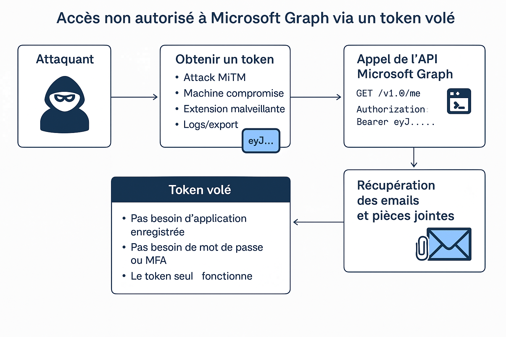

# 🎯 Génération d'un Access Token Microsoft Graph avec Device Code Flow (MSAL)

Ce guide explique comment utiliser **MSAL (Microsoft Authentication Library)** avec le **Device Code Flow** pour générer un token d'accès Graph utilisable dans des outils comme `graph_dump.py` (du projet MsGraphFunzy).

---

## 🔒 Pourquoi utiliser le Device Code Flow ?

- ✅ Authentification **interactive mais sans navigateur intégré**
- ✅ Compatible avec **PowerShell, Linux, WSL, etc.**
- ✅ Simple à mettre en œuvre pour les utilisateurs finaux

---

## ⚙️ Prérequis côté Azure

1. Connectez-vous à [https://portal.azure.com](https://portal.azure.com)
2. Créez une **App registration** dans Microsoft Entra ID :
   - Nom : `MsGraphFunzyClient`
   - Type : *Accounts in this organizational directory only*
   - Ne pas renseigner d'URI de redirection (non nécessaire ici)

3. Notez :
   - ✅ `Application (client) ID`
   - ✅ `Directory (tenant) ID`

4. Ajoutez les **permissions API Microsoft Graph** suivantes :
   - `Mail.Read`  ==> Delegated 
   - `User.Read`
   - (éventuellement `Mail.ReadWrite`, `Files.Read.All`, etc.)

5. Cliquez sur **Grant admin consent** si nécessaire.

---

## 🧰 Utiliser le script Python `token_device.py`

il sera nécessaire d'installer Pyhton3
Attention sur DietPi, étant une VM trés légère les outils ne sont pas installés. 

Il faut rendre executable le script 
```
chmod +x token_device.py


sudo apt install python3-pip -y

```


### 1. Installer les dépendances :
```bash
pip3 install msal --break-system-packages

# propre à debian...
```

### 2. Modifier les valeurs dans le script :
Dans `token_device.py`, remplacer :
```python
CLIENT_ID = "VOTRE_CLIENT_ID"
TENANT_ID = "VOTRE_TENANT_ID"
SCOPES = ["Mail.Read", "User.Read"]
```

### 3. Exécuter le script :
```bash
python3 token_device.py
```

Un lien et un code s'affichent :
```bash
https://microsoft.com/devicelogin
Code : XXXX-XXXX
```
Saisissez le code dans votre navigateur, connectez-vous.

### 4. Le token est généré et sauvegardé :
```
Token sauvegardé dans token.txt
```

Ce fichier est utilisable directement par le script `graph_dump.py` du projet MsGraphFunzy :
```bash
python3 graph_dump.py token.txt
```


## 🧼 Sécurité

- Ne stockez jamais le fichier `token.txt` dans un dépôt Git
- Utilisez des tokens à durée courte si possible
- Supprimez le fichier après usage si vous n’avez pas besoin d’auth persistante

---

##  Besoin d’autres scopes ?
Ajoutez simplement les permissions souhaitées dans la section `SCOPES = [...]` du script.

Exemples :
- `Calendars.Read`
- `Files.Read.All`
- `Sites.Read.All`

---***
#  Scénario : Exploitation d'un Token Microsoft Graph Volé





##  Contexte

Un utilisateur légitime s'est connecté à une application Microsoft 365.  
Un attaquant intercepte ou récupère son **Access Token (JWT)**.

---

## 🧭 Étapes de l’attaque

### 1. 🎣 Vol du token

- Attaque MiTM (proxy malveillant, extension de navigateur)
- Machine compromise (récupération du cache/token)
- Dump de mémoire ou logs
- Application mal sécurisée

→ 🎯 Token JWT Graph récupéré : `eyJ...`

---

### 2. 🧪 Test de validité

```bash
curl -X GET https://graph.microsoft.com/v1.0/me \
     -H "Authorization: Bearer eyJ..."


```
---


## 📦 Liens utiles

- [MS Graph Explorer (test API sans code)](https://developer.microsoft.com/en-us/graph/graph-explorer)
- [MSAL Python](https://pypi.org/project/msal/)
- [Microsoft Identity Platform - Device Code Flow](https://learn.microsoft.com/en-us/azure/active-directory/develop/v2-oauth2-device-code)

